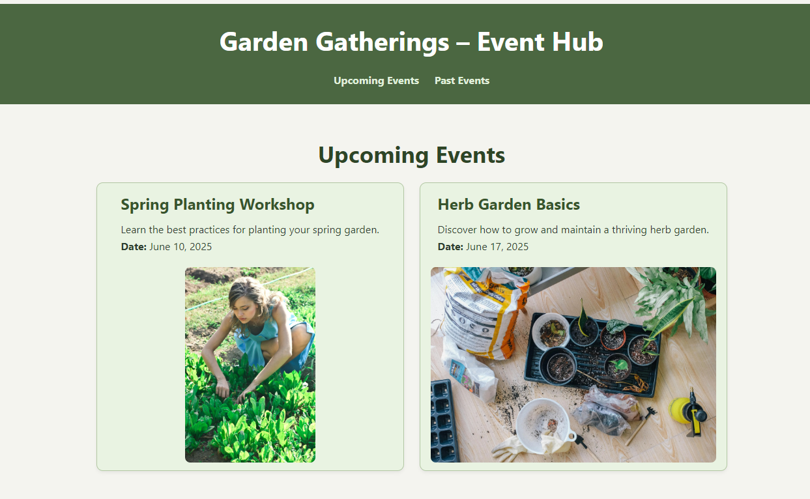

<h1>Garden Events Page</h1>

I created this events page to show my ability to use columns and responsive layouts in HTML and CSS. The page is built with a clean 2-column layout for desktop, and it automatically adjusts to a single column on mobile devices. I used semantic HTML elements like section, article, and nav, and styled everything using CSS Grid.

This project was a way for me to practice and show off what I’ve learned about building organized, responsive layouts without using any frameworks, just plain HTML and CSS. I kept the design earthy and professional to match the garden theme, while also making sure it’s accessible and easy to read.

  
  
    
